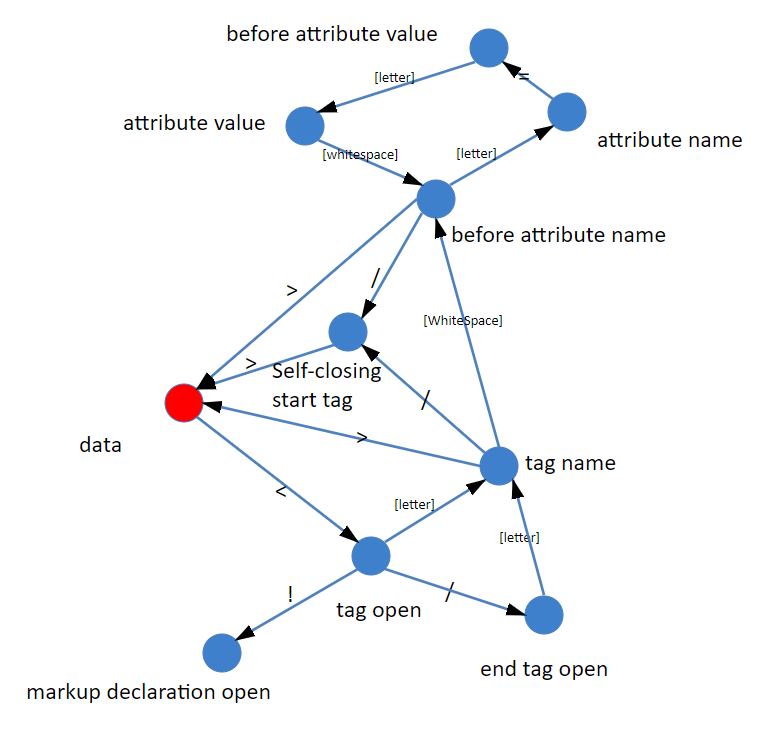

# 简单 html 解析器

- parseHtml.js 解析 html 文本测试结果
- lexer.js 将 html 文本加工成 token 对象
- syntaxer.js 将 token 对象转换为 tree 树

### [预览](view.html)

## parseHtml.js

```javascript
const { HTMLLexicalParser } = require('./lexer.js')
const { HTMLSyntaticalParser } = require('./syntaxer.js')
const html = `
  <html id='html'  c="3">
    <head>
      <title>lexer - html</title>
    </head>
    <body>
      <figure>
        
        <figcaption>img description</figcaption>
      </figure>
      <h2>I like the fruit</h2>
      <ul>
        <li>Apple</li>
        <li>Orange</li>
        <li>Banana</li>
        <li>
          <h3 style="color: red; background-color: gray;">Outer</h3>
          <ul>
            <li>Cherry</li>
            <li>Grape</li>
            <li>Mango</li>
          </ul>
        </li>
      </ul>
    </body>
  </html>
`

const lexer = new HTMLLexicalParser()
const syntaxer = new HTMLSyntaticalParser()
lexer.readHtml(html).output(syntaxer.receiveToken)
console.log(JSON.stringify(syntaxer.getDomTree()))
```

## lexer.js

```javascript
const lexer = {}
;(function(lexer) {
  let i = 0
  let tokens = []
  let token = null
  let attribute = null
  class HTMLLexicalParser {
    readHtml(html) {
      this.readed = true
      let char = ''
      i = 0
      let stateMachine = dataAnalyzer
      while ((char = getInput(html))) {
        stateMachine = stateMachine(char)
      }
      return this
    }

    output(receiveToken, html) {
      if (!this.readed) {
        this.readHtml(html)
      }
      for (const token of tokens) {
        receiveToken(token)
      }
    }
  }
  function getInput(html) {
    return html.charAt(i++)
  }
  function dataAnalyzer(char) {
    if (char === '<') {
      return tagOpen
    }

    emitToken(char)
    return dataAnalyzer
  }

  function tagOpen(char) {
    if (char === '/') {
      return endTagOpen
    }

    if (/[a-zA-Z]/.test(char)) {
      token = { tokenStart: true, name: char }
      return tagName
    }

    // 不合法的标签写法
    error(char, i)
  }

  function tagName(char) {
    // 检测到标签节点里的空格, 可能是属性节点
    if (/[\t\n\f\s]/.test(char)) {
      return beforeAttributeName
    }

    // 自封闭标签
    if (char === '/') {
      return selfClosing
    }

    // 开始标签结束
    if (char === '>') {
      emitToken(token)
      return dataAnalyzer
    }

    // 拼接标签名
    if (/[a-zA-Z1-6]/.test(char)) {
      token.name += char
      return tagName
    }
  }

  function beforeAttributeName(char) {
    // 过滤掉标签节点上的空格
    if (/[\t\n\f\s]/.test(char)) {
      return beforeAttributeName
    }

    // 检测到自封闭标签 如: <br />
    if (char === '/') {
      return selfClosing
    }

    // 检测开始标签结束
    if ('>' === char) {
      emitToken(token)
      return dataAnalyzer
    }

    // 检测到属性名
    if (/[a-zA-Z-]/.test(char)) {
      attribute = {
        name: char.toLowerCase(),
        value: ''
      }
      return attributeName
    }

    // 无效的写法 如： <div >
    error(char, i)
  }

  function attributeName(char) {
    if (/[a-zA-Z0-9-]/.test(char)) {
      attribute.name += char.toLowerCase()
      return attributeName
    }

    // 处理属性值
    if (char === '=') {
      return beforeAttributeValue
    }

    // 无效的写法 如： name =
    error(char, i)
  }

  function beforeAttributeValue(char) {
    // 检测到有引号包裹的属性值
    if (/['"]/.test(char)) {
      return attributeValueQuoted(char)
    }

    // 没有引号包裹的属性值
    attribute.value += char
    return attributeValueNoQuoted
  }

  function attributeValueQuoted(quote) {
    return function step(char) {
      // 属性值结束
      if (char === quote) {
        token[attribute.name] = attribute.value
        return beforeAttributeName
      }

      // 没有正确的引号匹配
      if ('>' === char) {
        error(char, i)
      }

      attribute.value += char
      return step
    }
  }

  function attributeValueNoQuoted(char) {
    // 检测到>符号, 认为是结束属性检测
    if ('>' === char) {
      token[attribute.name] = attribute.value
      emitToken(token)
      return dataAnalyzer
    }

    // 开始另外的属性
    if (/[\t\n\f\s]/.test(char)) {
      token[attribute.name] = attribute.value
      return beforeAttributeName
    }

    attribute.value += char
    return attributeValueNoQuoted
  }

  // 自封闭标签处理
  function selfClosing(char) {
    // 结束
    if ('>' === char) {
      emitToken(token)
      const endToken = { tokenEnd: true }
      endToken.name = token.name
      emitToken(endToken)
      return dataAnalyzer
    }
  }

  function endTagOpen(char) {
    if (/[a-zA-Z]/.test(char)) {
      token = { tokenEnd: true, name: char }
      return tagName
    }

    // 非法的结束标签
    error(char, i)
  }
  function emitToken(token) {
    tokens.push(token)
  }
  function error(char, i) {
    throw new SyntaxError('unexpected char ' + char + ' ;at position: ' + i)
  }

  lexer.HTMLLexicalParser = HTMLLexicalParser
})(lexer)

module.exports = lexer
```

## syntaxer.js

```javascript
class HTMLDocument {
  constructor() {
    this.isDocument = true
    this.childNodes = []
  }
}

class Node {}

class Element extends Node {
  constructor(token) {
    super(token)
    for (let k in token) {
      if (k === 'tokenStart') continue
      this[k] = token[k]
    }
    this.childNodes = []
  }
}

class Text extends Node {
  constructor(value) {
    super(value)
    this.value = value || ''
  }
}

function HTMLSyntaticalParser() {
  const stack = [new HTMLDocument()]
  let i = 0

  this.receiveToken = function(token) {
    let stackTop = stack[i]

    // 文本节点
    if (typeof token === 'string') {
      if (stackTop instanceof Text) {
        stackTop.value += token
      } else {
        const txt = new Text(token)
        stackTop.childNodes.push(txt)
        i++
        stack.push(txt)
      }
    } else if (stackTop instanceof Text) {
      // 文本节点出栈
      i--
      stack.pop()
      stackTop = stack[i]
    }

    // 元素节点
    if (token.tokenStart) {
      const e = new Element(token)
      // 对象的引用类型互相关联
      stackTop.childNodes.push(e)
      i++
      stack.push(e)
    }

    // 当前节点结束出栈
    if (token.tokenEnd) {
      stack.pop()
      i--
    }
  }

  this.getDomTree = () => stack[0]
}

module.exports = { HTMLSyntaticalParser }
```

## 流程图


